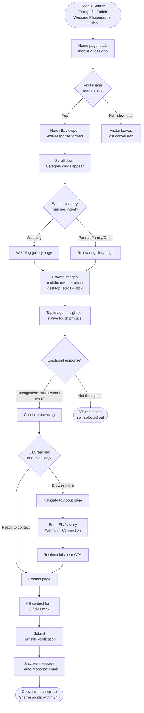
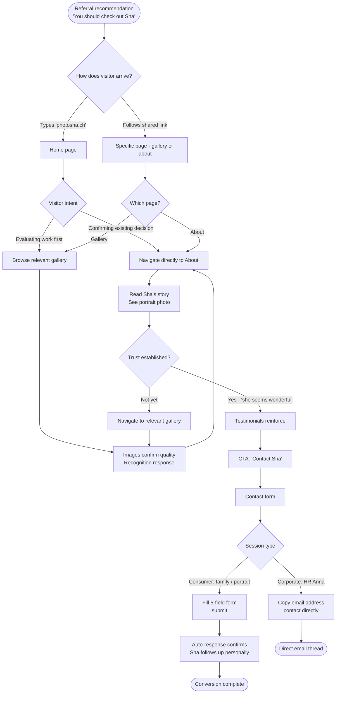
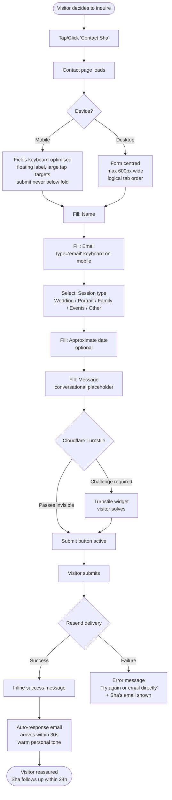

# UX Design Specification photosha

**Author:** jack
**Date:** 2026-03-22

---

<!-- UX design content will be appended sequentially through collaborative workflow steps -->

## Executive Summary

### Project Vision

photosha is a custom portfolio website for Sha, a Thai-Swiss photographer based in the Greater Zürich region. The site replaces an outdated 2020 website that fails to project Swiss market pricing or stand out visually against competitors. The UX goal is singular: convert more visitors into genuine inquiries from clients who arrive with Swiss pricing expectations.

The primary design register is **Quiet Luxury** — restrained, spacious, typographically precise. The photography is the hero. The design creates the conditions for the work to land with full impact, then steps back. Every UX decision is evaluated against one question: does this make the photography feel more valuable, or less?

### Target Users

Six personas, two distinct trust journeys:

**Cold traffic** (must be won on first visit): Swiss wedding couples (mobile, Instagram-referred), international destination clients (Google/platform-referred, English-speaking, one shot to impress), birthday/celebration clients (impulse-driven, discover the option on site).

**Warm traffic** (site confirms an existing decision): Thai–Swiss professionals (community-referred, need premium price signal to reframe expectations), Swiss family/portrait clients (referral-driven, About page is the trust checkpoint), corporate event clients (network-referred, need events portfolio and credibility signals).

**Primary device:** Mobile. The gallery experience on mobile is the product's most important UX surface and its clearest competitive differentiator.

### Key Design Challenges

1. **Native mobile gallery** — pinch-to-zoom, momentum scrolling, rubber-banding at edges. Must feel like a native iOS/Android app. No competitor in the Zürich market offers this. Technically the most complex UX requirement; also the most visible differentiator.
2. **Editorial navigation without friction** — quiet luxury design uses negative space and large type, which can obscure wayfinding. Challenge: make it feel like a premium magazine *and* be instantly navigable on mobile.
3. **Bilingual DE/EN without visual disruption** — language switching must feel natural and not break the typographic composition or layout rhythm.
4. **Conversion at the right moment** — CTAs placed at natural end-of-engagement points, not interrupting the browsing experience. Single CTA per page.
5. **Pricing signal integration** — "Starting from CHF X" must appear on category pages without feeling transactional or cheap against the premium visual register.

### Design Opportunities

1. **Mobile gallery as signature experience** — the first time a visitor pinches to zoom on a photo and feels the rubber-band resistance, they understand immediately that this site is different. This moment is unoccupied in the local market.
2. **White space as premium signal** — competitors' platform templates are visually crowded. Sha's site uses restraint as a differentiator. Less is a statement.
3. **Typography as personality** — in a quiet luxury register, the typeface choice carries the personality that the layout won't. A distinctive editorial typeface does the work of expressing character without decoration.
4. **About page as the warm counterpoint** — the rest of the site is quiet and restrained; the About page is where Sha's warmth and passion come through in full. This contrast makes both stronger.

---

## Core User Experience

### Defining Experience

The core loop of photosha is: **Find → See → Feel → Contact.**

A visitor finds Sha via Google Search ("Fotografin Zürich", "Hochzeitsfotograf Zürich"), lands on the site, browses the work, forms an emotional connection, and submits an inquiry. Every design decision exists to serve this loop or get out of its way.

The gallery browse is the product. When a visitor loses track of time looking at Sha's photography, contact is a natural conclusion. When it doesn't happen — when the gallery feels like a web page — the visitor leaves and tries the next result.

The single most important interaction: **a gallery photo landing with full visual impact**, whether on a phone screen or a 27-inch monitor. On desktop, that means edge-to-edge imagery with room to breathe. On mobile, it means native touch physics — smooth pinch-to-zoom, momentum, rubber-banding — that make the experience feel premium and considered.

### Platform Strategy

**Mobile-first in build priority; excellent on both.**

**Why mobile-first:**
- Google uses mobile-first indexing — SEO rankings are determined by the mobile version
- Initial discovery (quick Google search, Instagram second touchpoint) happens predominantly on mobile
- First impressions form on mobile; a poor mobile experience loses the visitor before they ever reach a desktop

**Why desktop must be equally strong:**
- High-consideration purchases (CHF 3,500–9,000+ wedding bookings) involve serious evaluation — comparing 5–10 photographers, looking at work at full resolution, reading the About page carefully
- Couples research together on a shared screen
- A desktop gallery that shows photographs at full scale with proper breathing room is itself a premium signal
- Contact form completion for considered inquiries often happens on desktop

**Input model:** Touch (mobile/tablet) and mouse/keyboard (desktop) both first-class. No interaction pattern works on only one.

**Performance baseline:** Images via Cloudflare R2 + CDN. Sub-1-second first image load on Swiss 4G and home broadband. Next.js Image optimization + responsive srcset mandatory.

**Language:** Bilingual DE/EN via Next.js i18n. Language state persists across navigation. Switcher always accessible, never visually dominant.

### Effortless Interactions

These must require zero conscious effort:

- **Mobile gallery:** swipe between photos, pinch-to-zoom with native physics (momentum, rubber-banding, smooth deceleration)
- **Desktop gallery:** keyboard arrow navigation, full-screen lightbox, smooth image transitions
- **Category navigation:** one tap/click to move between Portrait, Wedding, Event, Family, Landscape — always visible
- **Language switch:** one action, immediate, no page reload
- **Contact form:** keyboard-friendly on mobile, logical tab order on desktop, submit button never hidden below fold

### Critical Success Moments

**Moment 1 — First image loads instantly**
Sub-1-second on both mobile and desktop. A slow first load breaks the impression before it forms.

**Moment 2 — Gallery interaction feels native**
On mobile: first pinch-to-zoom feels like a native app, not a web approximation.
On desktop: full-screen image fills the monitor with no chrome, no distraction.

**Moment 3 — About page creates personal connection**
The visitor reads about Sha and thinks "I want to work with this person." This is the primary booking trigger. Failure here loses the booking at the final stage.

**Moment 4 — Contact form completes without friction**
Visitor submits, receives immediate auto-response. A broken or confusing form destroys a conversion that survived every previous step.

### Experience Principles

1. **Photography first** — if a design element competes with a photograph for attention, the design element loses.
2. **Both screens, one standard** — mobile and desktop receive equal design attention; neither is an afterthought.
3. **Friction is a conversion risk** — every extra tap, scroll, or form field between a visitor and sending an inquiry is a potential dropout.
4. **Restraint signals premium** — white space, typographic precision, and the absence of decoration communicate the same value as the photography itself.
5. **One next step per screen** — no page presents two competing primary actions. Every screen has a single clear path forward.

---

## Desired Emotional Response

### Primary Emotional Goals

A visitor to photosha should move through three emotional states in sequence:

**1. Awe** — "These photos are beautiful."
The first gallery image loads and the visitor stops scrolling. This is not just appreciation — it is the involuntary pause that precedes genuine consideration. Without this moment, nothing else matters.

**2. Recognition** — "This is exactly what I want."
As the visitor browses more work, they see themselves in the photographs. The wedding couple sees intimacy and light that matches their vision. The family client sees natural, unposed moments. This is the psychographic filter working as intended — the right client sees themselves; the wrong client self-selects out.

**3. Confidence** — "I can trust this person with my important day."
After the About page, the testimonials, the clear process — the visitor feels certain. Not just that Sha is talented, but that she is the right choice. This confidence is what converts awe into an inquiry.

### Emotional Journey Mapping

| Stage | Persona state arriving | Target emotion | Design lever |
|---|---|---|---|
| Landing — first image | Evaluating, comparing | Awe, arrested attention | Full-bleed hero, instant load, no chrome |
| Gallery browse | Curious, hopeful | Recognition, desire | Curated images that mirror ideal-client scenarios |
| Pricing signal | Anxious about cost | Relief, accessibility | "Starting from CHF X" — calm, clean, not apologetic |
| About page | Uncertain about fit | Warmth, connection | Sha's story, real portrait photo, personal voice |
| Testimonials | Seeking validation | Trust, certainty | Named testimonials with context, near CTAs |
| Contact form | Ready, slightly nervous | Ease, welcome | Conversational framing, minimal fields, instant confirmation |
| Auto-response received | Waiting, hopeful | Reassurance | Warm, personal tone — not a corporate acknowledgement |

### Micro-Emotions

These smaller emotional moments determine whether a visitor stays or leaves:

- **"This loads fast"** → implicit trust in professionalism (performance = care)
- **"I can zoom in properly"** → delight, native-feeling interaction signals premium
- **"The photos look real, not staged"** → relief for camera-shy clients (Sophie persona)
- **"She sounds human"** → warmth on About page, Sha's voice not a PR bio
- **"I can see the price range"** → relief, no fear of wasting anyone's time
- **"That was easy"** → after contact form submission, no regret, no second-guessing

**Emotions to actively avoid:**
- Price anxiety → mitigated by "starting from" signals appearing before the CTA
- Overwhelm → single CTA per page, curated galleries not dumps
- Distrust → testimonials, Impressum, GDPR notice, professional tone
- Confusion → clear navigation, obvious language switcher, visible category labels

### Design Implications

| Target emotion | UX design approach |
|---|---|
| Awe | Full-bleed images, minimal UI chrome during gallery view, generous white space around photos |
| Recognition | Per-niche gallery curation — show the work each persona wants to see themselves in |
| Relief | Pricing signal styled as informational, not promotional — same weight as body text |
| Warmth | About page breaks the Quiet Luxury restraint intentionally — warmer tones, candid portrait of Sha |
| Trust | Testimonials with name + context placed directly above or below primary CTA on each page |
| Ease | Contact form: 5 fields maximum, conversational placeholder copy, no asterisks, instant confirmation |
| Delight | Mobile gallery: native pinch-to-zoom with rubber-banding — the one moment of technical surprise |

### Emotional Design Principles

1. **Earn awe before asking for action** — no CTA appears before the visitor has seen at least one full gallery image
2. **Recognition is more powerful than persuasion** — curation that mirrors the ideal client's vision converts better than any copy
3. **Anxiety is the enemy of inquiry** — every pricing, process, and form decision should reduce, not defer, client anxiety
4. **Warmth lives on the About page** — the rest of the site is restrained; the About page is the emotional counterweight
5. **Delight must be earned** — the mobile gallery interaction is the one "wow" moment; it works because everything around it is calm

---

## UX Pattern Analysis & Inspiration

### Inspiring Products Analysis

**Editorial Magazines — Kinfolk, Monocle, Wallpaper\***

These publications succeed because they treat white space as content, not absence. The UX principles:

- **Pacing is designed, not accidental** — slow scroll rhythm is engineered through image scale and paragraph spacing; the reader doesn't rush because the layout doesn't push
- **Typography is navigation** — oversized section headers and pull quotes guide the eye without traditional nav chrome; the hierarchy is spatial, not mechanical
- **Full-bleed photography is the rule** — images escape their containers; text wraps around the work, not the other way around
- **One story per spread** — no competing content units on a single viewport; editorial focus = one thing at a time
- **Restraint signals curation** — what's left out is as deliberate as what's included; the magazine doesn't try to show everything

**Luxury Brand Sites — Bottega Veneta, Aesop, The Row**

These brands use UX to communicate the price point before a single product is seen:

- **Absence of decoration is the design** — no promotional banners, no countdown timers, no urgency triggers; the site is quiet because the brand is confident
- **Single primary action per screen** — no page competes with itself; there is always exactly one clear next step, and it is never pushed
- **Photography as product** — product shots fill the viewport; the UI (navigation, cart) recedes to the minimum required to function
- **Generous padding signals quality** — crowding = cheap; room to breathe = premium; this is the direct visual equivalent of a luxury retail store's floor plan
- **Navigation doesn't announce itself** — present but never dominant; users find it when they need it; it doesn't interrupt the browsing experience

**Photographer Portfolio Sites — Jonas Peterson, Jose Villa, KT Merry**

These are the benchmark references for the gallery-first portfolio:

- **The UI disappears when you're looking at the work** — logo and nav are present but visually recessive; the photographer's name and category labels are legible, not decorative
- **Gallery architecture is category-first** — all navigation begins with the niche (Wedding, Portrait, etc.); visitors self-sort before engaging
- **Lightboxes feel inevitable** — the transition from grid to full-screen is smooth and unmotivated; no jarring cut; the image expands as if it was always meant to fill the screen
- **About pages break the visual register deliberately** — the warm, human portrait of the photographer is the designed contrast to the restrained gallery; this contrast makes both sections stronger
- **Trust signals are near the CTA** — testimonials and process notes appear adjacent to the contact entry point, not buried in a separate page

---

### Transferable UX Patterns

**Navigation Patterns**

- **Recessive top navigation** (magazines + luxury brands) — logo left, 4–5 category links centre or right, language switcher right; all at small text weight; disappears on scroll, reappears on scroll-up. Applies to photosha's primary nav.
- **Category-first architecture** (photographer peers) — the five niches (Portrait, Wedding, Event, Family, Landscape) are the primary navigation; no intermediate landing page; one click from anywhere to a gallery. Eliminates friction in the Find phase.
- **Floating minimal nav on mobile** (luxury brands) — bottom-anchored or top-anchored minimal strip with category labels only. Keeps navigation accessible without competing with gallery imagery.

**Interaction Patterns**

- **Single CTA per viewport** (luxury brands + editorial) — no page presents two competing primary actions. Every screen has one path forward. Applies to all 9 photosha pages.
- **Deliberate scroll pacing** (editorial magazines) — section breaks, large white space, and image scale create natural pause points. The visitor doesn't scroll past the work; they stop with it.
- **Lightbox-first gallery viewing** (photographer peers) — tap/click any image → full-screen lightbox with keyboard/swipe navigation. The grid is the index; the lightbox is the experience.
- **Native touch gallery physics** (technical requirement) — pinch-to-zoom, momentum, and rubber-banding that makes mobile gallery feel like a native app. The one technical differentiator unoccupied in the Zürich market.

**Visual Patterns**

- **White space as premium signal** (all three categories) — padding and margin at 1.5–2× what platform templates use. Supports the Quiet Luxury register and the Awe emotional goal.
- **Typography-led hierarchy** (editorial magazines) — section headers large enough to read from a distance; body text small enough to recede. The visual hierarchy is felt before it is read.
- **About page as designed contrast** (photographer peers) — warmer tone, softer palette, personal portrait of Sha. The rest of the site is restrained; the About page is the emotional counterweight.
- **Pricing signal styled as body text** (luxury brands) — "Starting from CHF X" at the same visual weight as descriptive copy; never a badge, callout, or promotional treatment.

---

### Anti-Patterns to Avoid

- **Platform template visual sameness** — Squarespace/Pixieset/Format aesthetic: interchangeable grid layouts, generic serif/sans combinations, templated nav structure. Every major Zürich competitor uses this. Adopting any element erases the differentiation.
- **Thumbnail grid fragmentation** — showing 20+ small images in a tight grid fragments the visual experience; visitors process the grid as information, not emotion. Images must appear at a scale that creates the Awe response.
- **Multiple competing CTAs** — two buttons on one screen split attention and dilute both. One CTA per screen, always.
- **Pop-up interruption patterns** — newsletter overlays, discount modals, exit-intent prompts. Any interruption destroys the Quiet Luxury register and breaks the Awe → Recognition → Confidence journey. The Umami/nFADS analytics stack makes cookie consent pop-ups unnecessary.
- **Auto-play media** — background video, auto-playing audio, animated hero banners. Competes with the photography and adds performance weight.
- **CV-style About page** — listing credentials, awards, and technical camera specs. Visitors don't book credentials; they book people. The About page expresses Sha's personality and warmth.
- **Navigation that competes with imagery** — oversized nav links, bright nav backgrounds, persistent nav bars overlaid on gallery images. The nav should be invisible until needed.

---

### Design Inspiration Strategy

**What to Adopt**

- **Editorial white space and typographic hierarchy** (from magazines) — the visual foundation of the Quiet Luxury register and the single strongest differentiator from platform templates
- **Single CTA per screen** (from luxury brands) — friction is the primary conversion risk; competing actions reduce conversion
- **Gallery-first category architecture** (from photographer peers) — the gallery is the product; navigation must lead there immediately and get out of the way
- **About page as emotional contrast** (from photographer peers) — the Warmth and Connection emotional goals cannot be achieved within the restrained visual register; the About page is where Sha's personality has full expression

**What to Adapt**

- **Magazine editorial pacing** → adapted to vertical mobile-first scroll; the pacing principles apply, the horizontal axis does not
- **Luxury brand restraint** → adapted from product pages to gallery category pages; the visual logic (photography fills viewport, UI recedes) transfers exactly; commerce mechanics do not
- **Lightbox interaction model** (from photographer peers) → enhanced with native mobile touch physics; the interaction concept is proven, the execution is differentiated

**What to Avoid**

- Any visual element borrowed from platform templates (Squarespace, Pixieset) — even good individual choices become contaminated by association with the template aesthetic
- Interruption UX patterns — pop-ups, overlays, urgency signals — incompatible with the Quiet Luxury register and the emotional journey
- Thumbnail-scale gallery presentation — if images can't create the Awe response at the scale they're shown, they should not be shown at that scale

---

## Design System Foundation

### Design System Choice

**Custom design system built on Tailwind CSS + Headless UI primitives**

Zero imported visual styles from any component library. Every design decision — colour, typography, spacing, component shape — is custom to photosha. Tailwind CSS provides the utility foundation; Radix UI (or equivalent headless library) provides accessible, unstyled interactive primitives for complex interactions (lightbox, dialogs, focus management).

| Layer | Tool | Purpose |
|---|---|---|
| Utilities | Tailwind CSS | Spacing, type scale, responsive layout |
| Design tokens | `tailwind.config.ts` | Colour palette, font families, custom spacing scale |
| Headless primitives | Radix UI | Accessible lightbox focus-trapping, keyboard nav, dialogs |
| Touch physics | Custom (use-gesture or react-spring) | Native pinch-to-zoom, momentum scrolling, rubber-banding |
| Visual styles | 100% custom | No MUI, Chakra, shadcn/ui, or any design-system aesthetic defaults |

### Rationale for Selection

- **Visual differentiation is the core product** — all major Zürich competitors use Squarespace, Pixieset, or Format, which derive their aesthetic from the same pool of component libraries (MUI, Chakra). Any imported visual style risks importing the template aesthetic that photosha must not resemble.
- **Tailwind CSS is already the stack** — the project is initialised on Next.js + Tailwind; a custom design system built on this foundation requires no additional toolchain, no conflicts, no framework migrations.
- **Headless primitives solve the hard problems correctly** — the mobile gallery lightbox requires focus trapping, keyboard navigation (arrow keys), escape-to-close, and scroll-lock. Implementing these accessibly from scratch is error-prone. Headless UI handles the behaviour; the visual design remains entirely custom.
- **Jack is a capable developer** — no scaffolding shortcuts are needed. The cost of building custom is appropriate given the differentiation requirement.

### Implementation Approach

1. **Design tokens first** — define the complete token set in `tailwind.config.ts` before writing any component code: primary colour palette, typographic scale, spacing scale, border radii, shadow values, breakpoints.
2. **Component inventory** — identify all UI components required across 9 pages before building. Build each once; reuse consistently. No ad-hoc one-off styles.
3. **Mobile-first throughout** — all Tailwind classes written mobile-first; responsive variants applied upward. No desktop-first overrides.
4. **Typography system** — select typefaces and define the complete type hierarchy (display, heading 1–3, body, caption, label, pricing signal) as named Tailwind utilities before layout work begins.

### Customization Strategy

- **Colour palette**: Near-white background, near-black text, single muted accent (warm grey or dusty sage — TBD in visual design step). No vibrant accent colours; the photography provides all colour.
- **Typographic contrast**: One editorial serif or high-contrast sans for display/headings; one neutral sans for body. The pairing creates personality through contrast, not decoration.
- **Spacing scale**: Extended Tailwind spacing scale with larger values (24, 32, 40, 48, 64 units) to achieve the editorial white space that signals premium.
- **No design-system shadows or elevation** — flat design only. No card shadows, no lifted components. Elevation is communicated through whitespace and scale, not CSS box-shadow.
- **Imagery as the only decoration** — no background patterns, no gradient fills, no decorative SVG elements. Photography does the visual work.

---

## Defining Core Experience

### Defining Experience

**"Browse Sha's photography and forget you're on a website."**

The defining experience of photosha is the **mobile gallery browse** — specifically the moment a visitor opens a gallery category on their phone and the touch physics feel native. Swipe between photos: momentum carries. Pinch to zoom: rubber-bands at the edges, decelerates naturally. The experience is indistinguishable from iOS Photos or Google Photos. This is not a web page; it is the photography.

The equivalent desktop experience: a full-screen lightbox that fills the monitor edge-to-edge, no chrome, keyboard arrow navigation, the photograph at full resolution with room to breathe.

If we nail one thing, it is this: **a gallery photo landing with its full emotional weight**, whether the visitor is on a phone in a café or comparing photographers on a shared laptop screen.

### User Mental Model

Visitors arrive from Google Search ("Fotografin Zürich") or Instagram having just seen a portfolio thumbnail. Their mental model is built from every photographer website they've visited before — slow-loading galleries, thumbnail grids, lightboxes that feel like modal dialogs bolted onto a web page, and pinch-to-zoom that either does nothing or zooms the entire browser window.

Their expectation on mobile: *this will probably feel like a website.* The moment native touch physics respond correctly — momentum, rubber-banding — there is a cognitive recalibration: *this site is different.* That recalibration transfers to the photography: *this photographer is different.*

**Existing solution pain points:**
- Platform galleries: no true pinch-to-zoom on individual images; browser-level zoom only
- Platform lightboxes: feel like navigating to a new URL, not opening a photo
- Thumbnail grids: force visitors to process images as a list, not experience them individually
- Mobile scroll: no momentum, no rubber-banding — feels like dragging content, not flicking through it

### Success Criteria

- **Sub-1-second first image load** on Swiss 4G and home broadband — the image appears before the visitor registers the load
- **Pinch-to-zoom indistinguishable from iOS Photos** — correct momentum, rubber-band resistance at min/max zoom, smooth deceleration, no jank
- **Swipe between images feels inevitable** — velocity preserved, next image arrives with physical continuity, not a cut
- **No layout shift during image load** — dimensions known before load, space reserved, images drop in without moving content
- **Full-screen lightbox fills the desktop viewport** — no white border, no scrollbar, no competing UI during viewing
- **Keyboard navigation complete on desktop** — arrow keys, Escape, no broken focus state
- **Session duration > 2:30 on gallery pages** — the behavioural signal that visitors are experiencing the photography, not evaluating it

### Novel vs. Established Patterns

**Established patterns adopted:**
- Thumbnail grid as gallery index → lightbox for full-screen viewing (universal, no user education required)
- Category-based navigation → visitors self-sort by photography type
- Contact CTA at end of gallery scroll → natural end-of-engagement placement
- About page with personal portrait and biography → standard photographer portfolio trust pattern

**Novel pattern — native touch physics on web:**
The pinch-to-zoom + momentum + rubber-banding behaviour is technically achievable on web via Pointer Events API but almost no photographer portfolio site implements it correctly. The innovation is not a new interaction metaphor — it is **implementing a familiar metaphor to native-app standard on web**. No user education required; visitors discover it through natural use.

### Experience Mechanics

**Mobile Gallery**

| Phase | Detail |
|---|---|
| Initiation | Tap category → gallery loads; hero image fills 100vw × ~85vh; partial image below fold invites scroll |
| Scroll | Full-width images, varying aspect ratios, native momentum scroll between them |
| Tap → Lightbox | Full-screen overlay; image fills screen; swipe left/right to navigate |
| Pinch-to-zoom | Pointer Events; min 1×, max 4×; rubber-band at limits; momentum on release |
| Swipe between images | Horizontal swipe; velocity preserved; rubber-band resistance at first/last image |
| Close lightbox | Pinch-out below 1×, swipe down, or tap outside — springs back to gallery scroll position |

**Desktop Gallery**

| Phase | Detail |
|---|---|
| Initiation | Hover image → subtle scale/brightness signal; click → lightbox opens full viewport |
| Navigation | Arrow keys left/right; mouse wheel to zoom; Escape to close |
| Feedback | Smooth 200ms fade on open/close; minimal image counter (3/17); arrow indicators on hover only |
| Close | Escape or click outside; scroll position in gallery preserved |

---

## Visual Design Foundation

### Color System

**Palette — Warm Neutral Register**

| Token | Hex | Use |
|---|---|---|
| `background` | `#FAF8F5` | Page background — warm white |
| `surface` | `#F2EFE9` | Subtle section differentiation, form backgrounds |
| `border` | `#E8E3DC` | Hairline dividers, input borders |
| `text-primary` | `#1A1814` | All headings, body text, nav labels |
| `text-secondary` | `#6B6560` | Captions, labels, secondary copy |
| `text-tertiary` | `#A09890` | Placeholder text, disabled states |
| `accent` | `#C4A882` | CTA button backgrounds, active nav states, hover underlines |
| `accent-hover` | `#B39470` | CTA button hover state |
| `accent-secondary` | `#8C7B6B` | Testimonial attribution, pricing signal text |
| `overlay` | `rgba(26, 24, 20, 0.95)` | Gallery lightbox background |
| `overlay-ui` | `rgba(26, 24, 20, 0.6)` | Nav on scroll (translucent), lightbox UI elements |

**Colour logic:**
- The photography provides all vibrant colour. The palette exists to not compete.
- Warm white background complements skin tones in portrait and wedding photography — cooler whites create unflattering contrast.
- The accent (`#C4A882`) is derived from Sha's warm photography palette — sand, afternoon light, natural tones. It feels native to the imagery, not imported.
- No status colours except error state in the contact form.

### Typography System

**Font Pairing**

| Role | Font | Source | Weight |
|---|---|---|---|
| Display / Hero headings | Cormorant Garamond | Google Fonts (free) | Light 300, Regular 400 |
| Section headings (H2–H3) | Cormorant Garamond | Google Fonts | SemiBold 600 |
| Body / UI / Navigation | Inter | Google Fonts (free) | Regular 400, Medium 500 |
| Pricing signal | Inter | — | Regular 400 (same weight as body) |
| Language switcher | Inter | — | Medium 500, tracked |

**Rationale:** Cormorant Garamond's extreme stroke contrast reads as editorial at large display sizes — fashion magazine register. Inter provides maximum legibility for reading copy and UI labels — neutral, invisible when doing its job. High contrast between the two registers: expressive in headlines, precise in reading text.

**Type Scale**

| Level | Desktop | Mobile | Font | Weight | Use |
|---|---|---|---|---|---|
| Display | 96–120px | 56–72px | Cormorant | 300 | Hero headline, page name |
| H1 | 64px | 40px | Cormorant | 400 | Category page titles |
| H2 | 48px | 32px | Cormorant | 600 | Section headers |
| H3 | 32px | 24px | Cormorant | 600 | Testimonial names, sub-headers |
| Body large | 20px | 18px | Inter | 400 | About page body, category descriptions |
| Body | 16px | 16px | Inter | 400 | General copy, form labels |
| Caption | 13px | 13px | Inter | 400 | Image captions, meta text |
| Label / Nav | 12px | 12px | Inter | 500 | Navigation, buttons, pricing signal |

**Line heights:** Display/H1: 1.05 (tight, editorial); Body: 1.65 (open, readable); Caption: 1.5.

**Letter spacing:** Display and H1: `-0.02em` (tighten large serif); Labels and nav: `0.08em` (open tracking for small-caps/label register).

### Spacing & Layout Foundation

**Base unit:** 4px. Tailwind default scale extended with larger values in `tailwind.config.ts`:

```
spacing: {
  18: '72px',
  22: '88px',
  26: '104px',
  30: '120px',   // section spacing desktop
  36: '144px',
  44: '176px',   // hero / editorial breathing room
}
```

**Content widths:**

| Context | Max-width | Rationale |
|---|---|---|
| Gallery (full-bleed) | 100vw | No container — images own the full width |
| Text content (About, descriptions) | 720px | Comfortable reading line length |
| Contact form | 600px | Focused, not overwhelming on desktop |
| Nav inner | 1400px | Wide, contained on ultra-wide screens |

**Section vertical spacing:** 120px top/bottom desktop, 64px mobile. Primary source of the Quiet Luxury feel — competitors use 40–60px; the additional space is immediately legible as premium.

**Gallery layout:** Images stacked vertically at full width. No masonry grid (fragments emotional experience). Gap: 24px mobile, 40px desktop. Desktop thumbnail index uses 2-column layout only; single-column for primary experience.

### Accessibility Considerations

**Colour contrast (WCAG 2.1):**

| Combination | Ratio | Level |
|---|---|---|
| `text-primary` (#1A1814) on `background` (#FAF8F5) | ~15:1 | AAA |
| `text-secondary` (#6B6560) on `background` | ~5.5:1 | AA |
| White on `overlay` (rgba 0.95) | ~14:1 | AAA |
| `accent` (#C4A882) on `background` | ~2.3:1 | Decorative only — never for text |

**Accent constraint:** `#C4A882` is used exclusively for graphic/UI elements with white text on top (white on `#C4A882` passes at ~4.5:1). Never used as text colour itself.

**Interaction accessibility:**
- Focus states: `ring-2 ring-offset-2` in accent colour on all interactive elements
- Lightbox: focus trapped, `aria-modal`, `role="dialog"`, Escape to close
- Language switcher: keyboard accessible, `aria-label`
- Contact form: all fields labelled, error states with `aria-describedby`
- Minimum body text: 16px; minimum line height: 1.5 (meets WCAG 1.4.12)

---

## Design Direction Decision

### Design Directions Explored

Six directions were evaluated via interactive HTML mockup (`ux-design-directions.html`), all using the established warm neutral palette (Cormorant Garamond + Inter, `#FAF8F5` background):

| Direction | Layout Concept |
|---|---|
| A — Full-Bleed Overlay | Hero image fills full viewport, nav overlaid in white, categories as image cards |
| B — Editorial Split | Left column: large Cormorant type + category list; right column: single hero image |
| C — Masthead + Gallery | Large logo masthead, category tabs, gallery starts immediately |
| D — Staggered Editorial | Category sections alternate image left/right with descriptive text |
| E — Typographic Index | Oversized headline, categories as typographic list only (no thumbnail images on home) |
| F — Cinematic Column | Full-width hero, text + category grid, then expanding strip gallery |

### Chosen Direction

**Direction A — Full-Bleed Overlay**

The home page opens with a single photograph filling 100% of the viewport. The navigation floats over it in white text (no background). Sha's name and location are overlaid at the bottom of the hero with a subtle gradient scrim. Below the fold: the five gallery categories presented as full-width image cards with the category name and starting price overlaid.

### Design Rationale

- **Awe before anything else** — the first thing a visitor sees is a photograph at full scale. No UI competes. The Awe emotional goal is served in the first 500ms.
- **Photography announces the site** — no headline, no description, no CTA above the fold. The image does the selling. Text (and conversion) come after the visitor has already been stopped.
- **Navigation recedes into the image** — white text over a dark photograph is invisible until needed; it doesn't compete with the hero for attention.
- **Category image cards extend the photography-first logic** — below the fold, each category is represented by a photograph, not a label. Visitors who scroll see more photography, not navigation chrome.
- **Highest visual differentiation** — the full-bleed first load is the farthest from any platform template (all competitors show at least some UI chrome above their first image).

### Implementation Approach

**Home page layout:**
- `position: fixed` nav, `z-index` over hero — transparent background that gains `backdrop-filter: blur` + dark overlay on scroll
- Hero: `height: 100svh` (safe viewport height for mobile), single curated image as `next/image` with `priority` prop — must be the fastest-loading element on the page
- Hero overlay text: `position: absolute`, bottom-anchored, `mix-blend-mode: normal` over gradient scrim (`linear-gradient(to top, rgba(26,24,20,0.65) 0%, transparent 60%)`)
- Category cards: CSS grid `grid-template-columns: 1fr 1fr` on desktop; single column on mobile; images with `overflow: hidden` + subtle `scale` on hover via CSS transition
- Category card overlay: category name in Cormorant 28px, pricing label in Inter 11px — both `position: absolute` over image with text-shadow

**Gallery category pages:**
- Same nav treatment (floated, transparent-to-scroll)
- No hero — page title (Cormorant, large) over first image or as standalone header
- Full-width vertical image stack, native scroll, gap 24px mobile / 40px desktop
- Tap/click → lightbox (Direction A's visual language continues: dark overlay, image fills screen)

---

## User Journey Flows

### Journey 1 — Cold Traffic: Discovery to Inquiry

*Personas: Lena & Marco (Swiss wedding couple), James & Mei (international destination)*



**Key moments:**
- Sub-1s first image load is a binary gate — slow load = lost visitor
- Category self-selection removes unfit clients before they reach the CTA
- About page is the trust bridge for cold traffic; without it, inquiry rate drops
- Auto-response email must arrive within 30 seconds of submission

### Journey 2 — Warm Traffic: Referral Confirmation

*Personas: Sophie (camera-shy family client), Narin (Thai–Swiss professional), HR Anna (corporate)*



**Key moments:**
- Warm traffic often skips the gallery — About page is the primary destination
- Sophie (camera-shy) needs to see natural, unposed images *and* feel Sha's warmth before committing
- HR Anna may prefer direct email — Contact page must show both options
- Language state persists across language switch; a visitor who switches to English stays in English through gallery → about → contact

### Journey 3 — Contact Form Completion

*Applies to all personas after decision is made*



**Contact form fields:**

| Field | Type | Required | Notes |
|---|---|---|---|
| Name | Text | Yes | Placeholder: "Your name" — no asterisks |
| Email | Email | Yes | `inputmode="email"` on mobile |
| Session type | Select | Yes | Wedding, Portrait, Family, Events, Other |
| Approximate date | Text | No | Placeholder: "When are you thinking?" |
| Message | Textarea | Yes | Placeholder: "Tell me a little about what you have in mind" |

### Journey Patterns

**Navigation patterns:**
- **Single entry point per screen** — one primary CTA per page; no competing decisions
- **About page as universal trust checkpoint** — linked from every gallery page, not just the nav
- **Language persistence** — language state maintained across all navigation

**Feedback patterns:**
- **Immediate visual response** — all interactions respond within 100ms via CSS transition
- **All fields visible at once** — no multi-step form; single submission action
- **Graceful error recovery** — if form submit fails, Sha's direct email shown as fallback

**Flow optimisation principles:**
1. **No gates before the gallery** — no splash screens, no cookie banners, no pop-ups; gallery is one tap from home
2. **Single CTA per page** — competing CTAs removed throughout
3. **End-of-gallery CTA** — natural exit from any gallery leads to contact; visitors who reach the end are ready
4. **Auto-response as designed UX** — 30-second auto-response email continues the warmth of the About page

---

## Component Strategy

### Design System Components

**Tailwind utilities (no custom code):** Layout primitives, typography scale, colour tokens, responsive breakpoints — all via `tailwind.config.ts`.

**Radix UI headless primitives (behaviour only, visually custom):**
- `@radix-ui/react-dialog` — focus trapping, keyboard handling, `aria-modal` for GalleryLightbox
- `@radix-ui/react-select` — keyboard-accessible session type dropdown in ContactForm

**Touch physics:**
- `@use-gesture/react` — pointer/touch event handling (pinch, swipe, drag)
- `react-spring` — physics-based animation (momentum deceleration, rubber-banding)

### Custom Components

**11 custom components across 9 pages:**

#### NavBar
Fixed navigation overlaid on hero; transitions transparent→blur-on-scroll on interior pages.
- **States:** Transparent (hero/top) · Blurred dark (scrolled) · Opaque on-bg (interior pages) · Mobile (collapsed)
- **Accessibility:** `role="navigation"`, `aria-label="Main navigation"`, `aria-current="page"` on active link

#### HeroImage
Full-viewport first impression. Single photograph, gradient scrim, name + location overlaid at bottom.
- `height: 100svh`, `next/image` with `priority`, gradient scrim via CSS `::after`
- `placeholder="blur"` — no flash on load

#### CategoryCard
Home page grid. Photograph with category name (Cormorant) + pricing (Inter Label) overlaid.
- **States:** Default · Hover (`scale(1.03)` on image, 400ms) · Focus (ring on wrapper)
- **Variants:** Standard (2-col) · Wide (full-width — Landscape)
- **Accessibility:** Entire card is `<a>` with descriptive `aria-label`

#### GalleryScroll
Full-width vertical image stack on category pages. The primary browse surface.
- Single column, 100% width images, `aspect-ratio` from metadata, native momentum scroll
- `next/image` with `sizes="100vw"` and responsive srcSet; dimensions reserved before load (no CLS)

#### GalleryLightbox
Full-screen viewer with native touch physics. The defining experience.
- **Mobile:** Pinch-to-zoom (1×–4×), rubber-band at limits, swipe between images with velocity carry, swipe-down to close
- **Desktop:** Arrow keys, mouse-wheel zoom, Escape to close, prev/next on hover
- Radix Dialog (focus trap + aria) + use-gesture (touch events) + react-spring (physics)
- Preloads adjacent images on open; scroll-lock on body while open
- **Accessibility:** `role="dialog"`, `aria-modal="true"`, `aria-label="Photo viewer"`, full keyboard support

#### LanguageSwitcher
DE/EN toggle. One action, immediate, no page reload. Persists via Next.js i18n locale routing.
- Active locale: `text-primary`; inactive: `text-tertiary` with hover underline
- `aria-current="true"` on active, `hreflang` on `<a>` tags

#### ContactForm
5-field inquiry form. Mobile-optimised, Turnstile-protected, Resend delivery.
- Fields: Name · Email (`inputmode="email"`) · Session type (Radix Select) · Approximate date (optional) · Message
- React Hook Form for state; Resend via Route Handler; `@marsidev/react-turnstile`
- All fields have `<label>`, `aria-required`, errors via `aria-describedby`; `aria-live` region for submit result

#### TestimonialCard
Named testimonial (quote + attribution). Placed within 200px scroll of primary CTA — never isolated.
- Max 3 sentences, first name + session type + year minimum. No anonymous testimonials.

#### PricingSignal
"Weddings from CHF 3,500" in Inter body weight. Same size and colour as surrounding body text — informational, never promotional. Above/adjacent to primary CTA on Portrait, Wedding, Event, Family pages only.

#### FooterBar
Single-row footer: copyright · Impressum · Privacy Policy · Language switcher. `background: var(--surface)`.

#### AutoResponseEmail (Resend / React Email template)
Sent within 30 seconds of form submission. Greeting by name → personal acknowledgement → "Sha will reply within 24h" → first-name signature. Plain text fallback. No logo or header image — same warmth register as the About page.

### Component Implementation Strategy

```
app/
  components/
    nav/        NavBar, LanguageSwitcher
    hero/       HeroImage
    gallery/    GalleryScroll, GalleryLightbox, CategoryCard
    contact/    ContactForm, TestimonialCard, PricingSignal
    layout/     FooterBar
  emails/
    inquiry-auto-response.tsx
```

### Implementation Roadmap

| Phase | Components | Dependency |
|---|---|---|
| 1 — Structure | NavBar, LanguageSwitcher, FooterBar, HeroImage | Everything else depends on nav and hero |
| 2a — Gallery core | GalleryScroll, CategoryCard, GalleryLightbox (keyboard + fade) | Core product; desktop experience |
| 2b — Touch physics | GalleryLightbox native pinch/swipe/momentum | The differentiator; most complex |
| 3 — Conversion | ContactForm, AutoResponseEmail, TestimonialCard, PricingSignal | Final conversion flow |
| 4 — Polish | Keyboard audit, WCAG check, LCP/CLS audit, momentum fine-tuning | Pre-launch quality gate |

---

## UX Consistency Patterns

### Button Hierarchy

| Level | Appearance | Use |
|---|---|---|
| **Primary** | `bg-[#1A1814]` white text, Inter 11px 500 weight, `letter-spacing: 0.1em`, uppercase, `padding: 16px 40px`, no border-radius | One per page — the single CTA |
| **Secondary** | Transparent bg, `border: 1px solid var(--text)`, same type | Rare — when a primary CTA already exists and a second action is unavoidable |
| **Ghost / Text link** | No bg, no border, underline on hover, Inter label sizing | Navigation-level actions: category links in text |

**Rules:** Never two primary buttons on the same screen. Button labels are task-verbs ("Contact Sha", not "Let's Talk!"). No border-radius. Primary hover: `background: var(--accent-hover)`, 150ms transition.

### Feedback Patterns

**Loading:**
- Images: `placeholder="blur"` — warm blurred preview; no spinners
- Form submit: button shows inline spinner, label changes to "Sending…", becomes disabled

**Success:**
- Contact form: inline success message replaces form — "Thanks, [Name]. Sha will be in touch within 24 hours." No redirect.
- Language switch: immediate page re-render; no toast or confirmation

**Errors:**
- Form field: red `border-color` + error text below via `aria-describedby`
- Form submit failure: error above submit button with Sha's direct email as fallback; submit re-enables
- Image load failure: alt text displayed; container maintains layout

**No toast notifications.** All feedback is inline, contextual, and calm. Toasts break the Quiet Luxury register.

### Form Patterns

- **Labels:** Visible `<label>` above each field — not placeholder-only
- **Focus:** `border-color: var(--text)` + `outline: 2px solid var(--text)` offset 2px
- **Error:** `border-color: #C0392B` + error message in Inter 13px below field
- **No green checkmarks** — don't over-communicate success

**Mobile keyboard optimisations:**

| Field | type / inputmode | autocomplete |
|---|---|---|
| Name | `text` | `name` |
| Email | `email` | `email` |
| Session type | Radix `<select>` | off |
| Date | `text` / `inputmode="text"` | off |
| Message | `<textarea>` | off |

Tab order: top to bottom, no unexpected jumps. All 5 fields + submit visible without scrolling on iPhone SE.

### Navigation Patterns

**Desktop:**
- Fixed, `z-index: 50`; transparent on hero → `backdrop-filter: blur(12px)` + dark overlay after 80px scroll
- Interior pages: `background: var(--bg)`, `border-bottom: 1px solid var(--border)`
- Active link: `border-bottom: 2px solid var(--text)`; inactive: `color: var(--text-2)`
- Hover: underline slides in, 200ms

**Mobile:** Category links as scrollable row below logo bar, or hamburger → full-screen overlay (finalised in responsive step).

**Language switcher:** Always in nav, never hidden. Active locale full opacity; inactive at `text-tertiary`.

**Scroll:** No scroll-jacking anywhere. Lightbox locks body scroll (`overflow: hidden`). Scroll position restored on lightbox close.

### Image Loading Patterns

- All images via `next/image` — never raw ``
- `placeholder="blur"` + `blurDataURL` on every image
- `sizes` prop always explicit: `"100vw"` full-width, `"50vw"` 2-column
- `alt` always descriptive: "Wedding couple at Zürich lakeside" not "photo"
- Hero: `priority={true}` — no lazy load
- Gallery: lazy-loaded, `aspect-ratio` from metadata (prevents CLS), fade in `opacity: 0→1` 200ms on load
- Lightbox: adjacent images preloaded when lightbox opens

### Overlay & Lightbox Patterns

- **Open:** overlay fades in 200ms; body scroll locked immediately; focus trapped (Radix Dialog)
- **While open:** `aria-modal="true"`, `role="dialog"`; ← → navigate, Escape closes, Tab stays within
- **Close:** Escape, tap backdrop, swipe-down (mobile), pinch below 1× (mobile); 150ms fade out; focus returns to trigger element; scroll position restored

### Hover & Focus Consistency

- All interactive elements: `outline: 2px solid var(--text)`, `outline-offset: 2px` — no `outline: none` without equivalent
- Hover transitions: max 200ms, `ease` or `ease-out` — spring/bounce reserved for touch physics only
- `cursor: pointer` on all non-link clickables; `cursor: zoom-in` on gallery images
- Image hover (gallery + category cards): `transform: scale(1.03)`, 400ms ease, `overflow: hidden` on container

---

## Responsive Design & Accessibility

### Responsive Strategy

Mobile-first in code; equally excellent on both. All Tailwind classes written mobile-first; responsive variants (`md:`, `lg:`) add desktop behaviour on top. Swiss market: iOS + Safari is the primary mobile browser — test all touch interactions on Safari iOS first.

| Device | Width | Primary use |
|---|---|---|
| iPhone SE (minimum) | 375px | Verify nothing breaks |
| iPhone 14 Pro (primary) | 393px | Main mobile target |
| iPad | 768px | Tablet breakpoint |
| MacBook 13" | 1280px | Standard desktop |
| Wide desktop | 1440px+ | Max-width container applies |

### Breakpoint Strategy

Tailwind defaults with one addition:

```js
screens: {
  'xs': '375px',  // iPhone SE minimum
  // sm (640), md (768), lg (1024), xl (1280), 2xl (1536) — Tailwind defaults
}
```

**Component responsive behaviour:**

| Component | Mobile (< 768px) | Desktop (≥ 1024px) |
|---|---|---|
| NavBar | Logo + lang switcher; category links as horizontal scroll row | Full links inline |
| HeroImage | `100svh`, text `bottom: 32px left: 24px` | `100svh`, larger display type, more padding |
| CategoryCard grid | Single column | 2-column; Landscape spans full width |
| GalleryScroll | Full-width, `gap: 16px` | Full-width, `gap: 40px` |
| GalleryLightbox | Pinch-zoom, swipe nav, swipe-down close | Arrow keys, wheel zoom, Escape; hover arrows |
| ContactForm | Full width, mobile keyboards | Max-width 600px, centred |
| Type: Display | 56–72px | 96–120px |
| Type: H1 | 40px | 64px |

### Accessibility Strategy

**Target: WCAG 2.1 Level AA.** Maintain AAA where already achieved (primary text contrast ~15:1).

**Touch targets:** Minimum 44×44px on all interactive elements. Form fields `min-height: 48px` on mobile.

**Semantic HTML:** `<header>`, `<nav>`, `<main>`, `<footer>` on every page. `<h1>` on every page. Heading hierarchy never skips levels. `<form>`, `<fieldset>`, `<legend>` for contact form.

**Screen reader requirements:**
- Gallery images: descriptive `alt` text (content, not decoration)
- Icon-only buttons: `aria-label` (lightbox close, prev, next)
- Form results: `aria-live="polite"` region
- Active nav link: `aria-current="page"`
- Active language: `aria-current="true"`
- `<html lang="de">` / `<html lang="en">` per locale via Next.js i18n

**`prefers-reduced-motion`:** All CSS transitions and animations suppressed when enabled. Global rule:
```css
@media (prefers-reduced-motion: reduce) {
  *, *::before, *::after {
    animation-duration: 0.01ms !important;
    transition-duration: 0.01ms !important;
  }
}
```
Lightbox: images snap to position (no spring). Image fade-in: instant.

**Skip link:** First focusable element on every page — `<a href="#main-content">Skip to main content</a>`, visible on focus, styled with accent colour.

### Testing Strategy

**Devices (real hardware, mandatory pre-launch):** iPhone SE, iPhone 14 Pro, iPad, MacBook 13", wide desktop.

**Browsers:** Safari iOS (critical), Chrome Android (high), Safari macOS (high), Firefox desktop (medium).

**Accessibility checklist:**
- [ ] Axe DevTools — resolve all Critical and Serious issues
- [ ] Keyboard-only navigation — full site without mouse
- [ ] VoiceOver iOS — gallery browse + contact form
- [ ] VoiceOver macOS — full site navigation
- [ ] Contrast — verify all text combinations
- [ ] 200% browser zoom — no content cut off
- [ ] Reduced motion — all animations suppressed
- [ ] Touch targets — all ≥ 44×44px

**Performance targets (Lighthouse):** LCP < 1.5s · CLS < 0.1 · a11y score ≥ 95

### Implementation Guidelines

- All base styles mobile-first; `md:` and `lg:` for desktop
- Font sizes in `rem`; viewport heights in `svh`/`dvh`; fluid display type via `clamp()`
- Images: `sizes` prop always explicit; `aspect-ratio` CSS reserves space before load
- Focus states via `:focus-visible` (not `:focus` — avoids rings on mouse click)
- Form errors: text adjacent to field via `aria-describedby`, never colour-only
- Lightbox: use Radix UI Dialog — do not re-implement focus trapping manually
- `prefers-reduced-motion`: CSS global rule, not per-component
